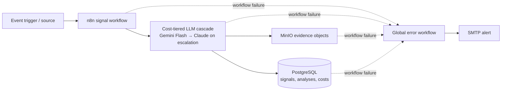

# Competitive Intelligence Platform

An event-driven n8n pipeline that turns market signals into traceable, cost-aware intelligence using a tiered LLM cascade.

## Demo

The interactive demo uses synthetic signals and displays the Tier 1 confidence gate and conditional Tier 2 route.

The live page can show live workflow results, API mock results, or a clearly labeled local fallback depending on backend availability. No production or customer data is used in the samples.

## Screenshots

| Workflow run | Architecture | Evidence and data model |
| --- | --- | --- |
| Screenshot placeholder: workflow run | Screenshot placeholder: architecture | Screenshot placeholder: data model |

The architecture diagrams already in the repository are linked below; add UI screenshots to replace the placeholders.

## Features

- Six-workflow, event-driven design for signal intake, analysis, storage, and operational alerting.
- Cost-tiered LLM cascade: Gemini Flash handles the initial assessment; uncertain signals escalate to Claude.
- MinIO object storage retains source evidence separately from structured PostgreSQL records.
- Global error workflow records failures and sends SMTP alerts.
- Confidence-based routing and duplicate suppression using content hashes.
- Estimated cost reduction of approximately 70% versus sending every signal through the deeper model tier. This is an estimate; measured production figures belong in Results.

## Architecture

The broader design uses Redis queue mode to separate n8n trigger handling from worker execution. See [architecture.png](architecture.png), [signal flow](signal_flow.png), and [the complete diagram set](architecture-diagrams/).

## Stack

- **Orchestration:** n8n
- **Models:** Gemini Flash for Tier 1; Claude for escalated Tier 2 analysis
- **Structured state:** PostgreSQL
- **Evidence objects:** MinIO (S3-compatible API)
- **Queue execution:** Redis and n8n queue mode
- **Integrations:** REST APIs and SMTP
- **Portfolio demo:** HTML, CSS, and JavaScript with synthetic samples

## Quickstart

This repository contains the portfolio site and architecture diagrams. It does not currently include n8n workflow export JSON files. Import the six workflow exports from the project delivery into your n8n instance, then configure the credentials and environment-specific endpoints below.

1. Create or open an n8n instance. For queue-mode deployments, configure the Redis, PostgreSQL, main, and worker services for your environment.
2. Import the six workflow JSON exports into n8n.
3. In n8n Credentials, configure the model provider credentials, PostgreSQL, MinIO/S3, REST source APIs, and SMTP account used by the workflows.
4. Set workflow variables and webhook endpoints for your deployment. Use [`.env.example`](.env.example) as a local template; keep real secrets in n8n credentials or the host environment.
5. Activate the appropriate event triggers and test with synthetic signals before connecting production sources.

To preview the portfolio page locally, run `python -m http.server 8000` and open <http://localhost:8000>.

## The six workflows

The responsibilities below describe the documented system design. Workflow exports are not present in this repository, so node-level behavior should be checked against the deployment exports.

1. **Signal intake:** Event or source triggers start a run and capture the incoming market signal with its source context.
2. **Normalize and deduplicate:** Normalize the payload, calculate a content hash, and check PostgreSQL to suppress repeat signals while preserving traceability.
3. **Tier 1 assessment:** Send eligible signals to Gemini Flash for a fast, lower-cost structured assessment and confidence score.
4. **Escalation and Tier 2 analysis:** Apply the confidence threshold; send uncertain cases to Claude for deeper review and retain Tier 1 results for comparison.
5. **Persist intelligence and evidence:** Store signal and analysis records, tier and estimated cost in PostgreSQL; save source evidence as MinIO objects and record object metadata.
6. **Global error handling:** Catch workflow failures, append diagnostic context to the error log, and notify operators through SMTP.

## Key technical decisions

- **Cost-tiered cascade:** Use the fast, inexpensive model for routine classification and pay for deeper analysis only when confidence is below the configured threshold. The threshold makes the cost/quality tradeoff explicit and tunable.
- **MinIO for evidence:** Keep larger source documents and binary evidence in S3-compatible object storage, while PostgreSQL holds searchable records and object keys. This separates storage concerns and keeps evidence addressable.
- **Global error handling:** Route failures to a dedicated error workflow so errors can be logged with workflow, node, and trace context and surfaced through SMTP alerts.
- **Retries and fallbacks:** Retry transient API or storage failures with bounded attempts and backoff; use idempotency/deduplication to limit duplicate writes. If a model or integration remains unavailable, record the failure and route it for retry or operator review rather than silently treating incomplete output as success. Match exact retry settings to the deployed exports.
- **Cost observability:** Record the selected tier, confidence, and estimated model cost so routing and savings assumptions can be audited.

## Results

Replace these placeholders with measured values and the measurement window before presenting them as verified outcomes.

- **Estimated LLM cost reduction:** ~70% versus an all Tier 2 baseline (assumption-based estimate; validate against actual usage).
- **Tasks processed:** `[add measured count and period]`
- **Error rate:** `[add measured rate and period]`
- **Cost savings:** `[add measured amount, currency, and period]`

## Roadmap

- Add an animated end-to-end workflow demo and screenshots.
- Publish sanitized n8n workflow exports with example configuration and credential setup notes.
- Add a reproducible evaluation set for confidence thresholds, routing quality, and cost.
- Report measured throughput, cost savings, and reliability over a defined period.

## License

No license is currently specified in this repository. All rights reserved unless a license is added; contact the author before reuse.

## Contact

**Meriem Neffeti** · [neffetimeriem@gmail.com](mailto:neffetimeriem@gmail.com)
